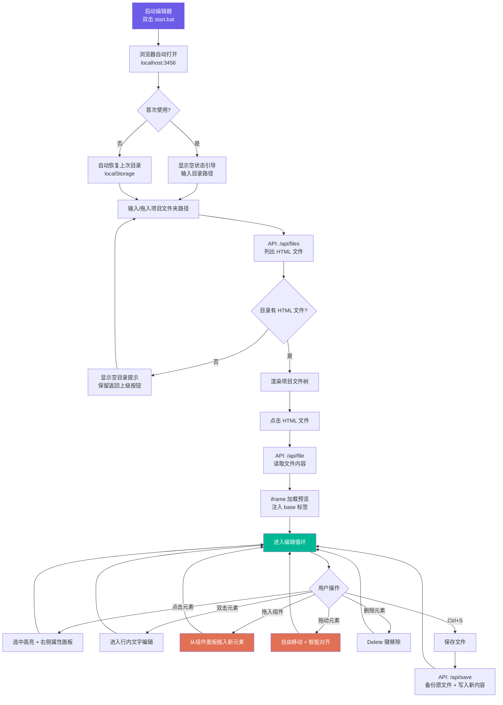
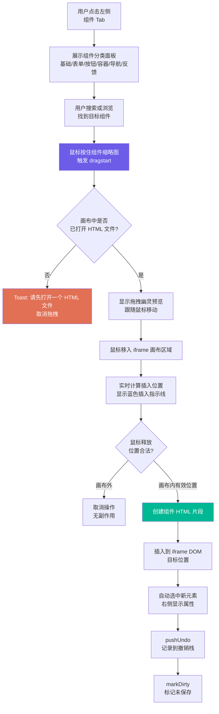
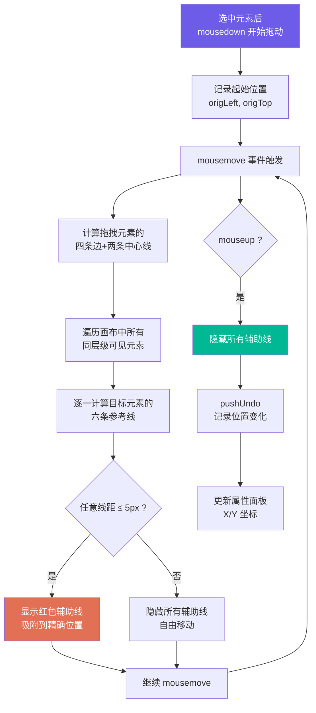
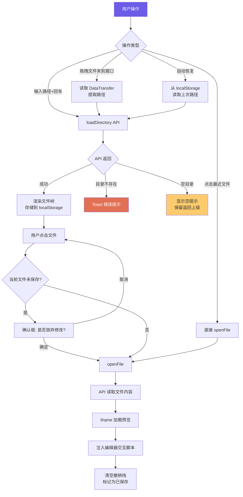
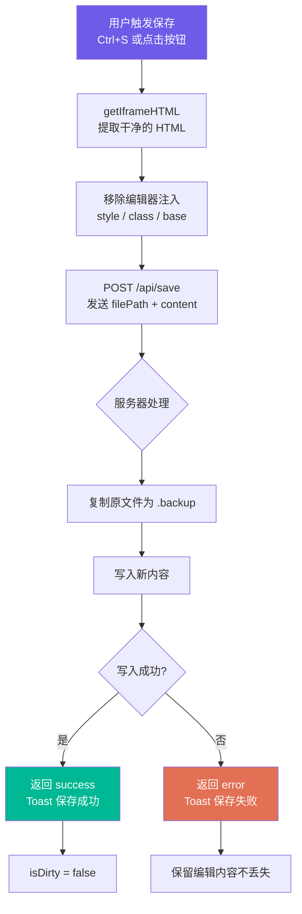
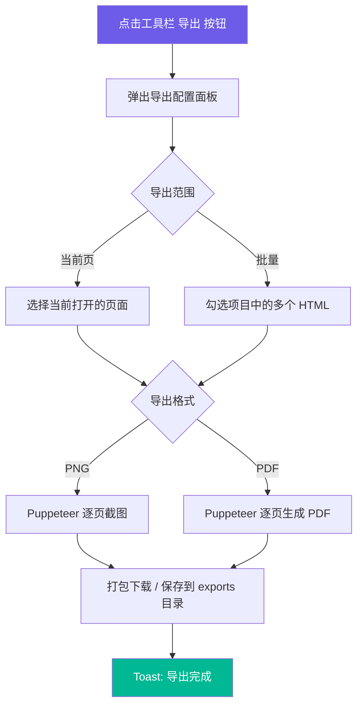
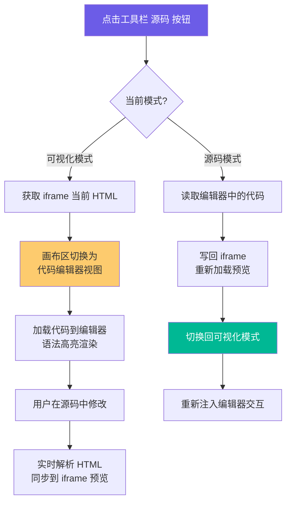

# HTML 原型编辑器 — 核心流程图

> 📅 版本: v1.0 | 更新日期: 2026-03-30

---

## 1. 总体操作主线流程

---

## 2. 组件拖拽添加流程 (P1 核心)

---

## 3. 智能对齐辅助线流程 (P1 核心)

---

## 4. 文件打开与项目管理流程

---

## 5. 保存与备份流程

---

## 6. 批量导出流程 (P4)

---

## 7. 源码编辑模式切换流程 (P5)

